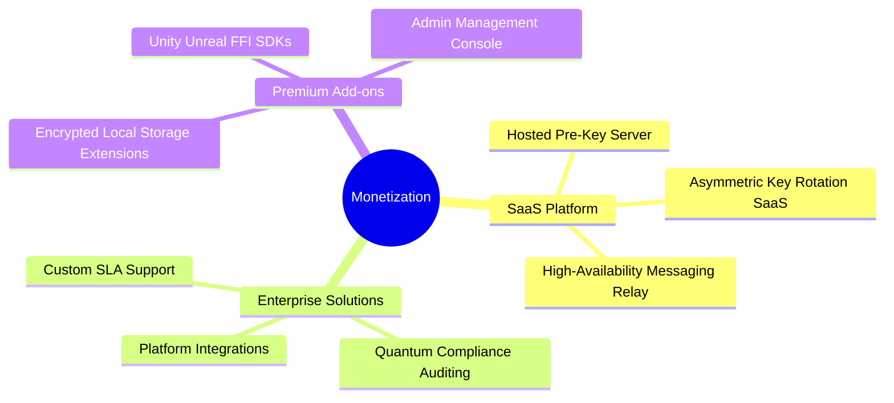

# PQ-Aura — Future Monetization Expansion Plans

This document outlines the strategic roadmap for expanding revenue generation for the **PQ-Aura** SDK beyond the initial GPLv3 / Commercial SDK dual-license.

---

## 🗺️ Strategic Roadmap Overview

---

## ☁️ 1. SaaS & Hosted Infrastructure (Managed Services)

While developers can run the open-source Axum key server locally, self-hosting cryptographic infrastructure poses maintenance, compliance, and uptime challenges.

### A. Hosted Pre-Key & Mailbox Cloud (B2B SaaS)
* **Description:** A fully managed, multi-tenant cloud service that registers users, stores pre-key bundles, and buffers offline messages.
* **Pricing Model:** Tiered subscription:
  * **Hobby ($0/mo):** Up to 100 monthly active users (MAU), community support.
  * **Startup ($49/mo):** Up to 5,000 MAU, sqlite auto-backup, 99.9% uptime.
  * **Growth ($199/mo):** Up to 50,000 MAU, globally replicated clusters, 99.99% SLA.
  * **Enterprise (Custom):** Dedicated instances, custom domains, high-throughput pipelines.

### B. Post-Quantum Key Rotation SaaS
* **Description:** Automatic periodic rotation of Signed Pre-keys (SPKs) and cleanup of stale One-Time Pre-keys (OPKs) triggered via automated cron services.

---

## 🛠️ 2. Premium Developer Add-ons & Plugins

Offer pre-built cryptographic building blocks that integrate natively with the core Double Ratchet client engine.

### A. Encrypted Local Storage Plugin
* **Description:** A secure storage wrapper (e.g., SQLite/SQLCipher or custom key-value store) that automatically encrypts local chat messages, file directories, and keys at rest on the client device using keys derived from the active ratchet state.
* **Target:** Flutter, iOS, and Android mobile developers.
* **Pricing:** One-time purchase of $99 per developer or $29/month.

### B. Game Engine SDK Wrappers
* **Description:** Pre-packaged native wrappers for high-performance multiplayer game development platforms:
  * **PQ-Aura for Unity (C# FFI)**
  * **PQ-Aura for Unreal Engine (C++ SDK)**
* **Pricing:** $299 per game title release.

---

## 🏢 3. Enterprise Solutions & Advisory

Direct support and custom engineering contracts targeting industries undergoing Post-Quantum Cryptography (PQC) migrations (e.g., finance, healthcare, defense).

### A. Quantum Readiness Compliance Audits
* **Description:** Security analysis of a client's legacy network, assessing vulnerabilities to "Harvest Now, Decrypt Later" (SNDL) attacks, and drafting transition blueprints.
* **Pricing:** Consultative contract pricing ($5,000 - $25,000 per project).

### B. Platform-Specific Integration Services
* **Description:** Direct engineering help for binding the native Rust FFI library into legacy enterprise structures (e.g., custom Linux servers, private intranet frameworks).

---

## ⚙️ 4. Actionable Next Steps

| Horizon | Goal | Estimated Effort |
| :--- | :--- | :--- |
| **Short-term** | Package and document the SQLite Database encryption wrapper. | 3–5 Days |
| **Medium-term** | Deploy a hosted instance of the Axum server on AWS/GCP to offer as a managed pilot. | 1–2 Weeks |
| **Long-term** | Launch the self-hosted admin control panel dashboard license. | 1 Month |
